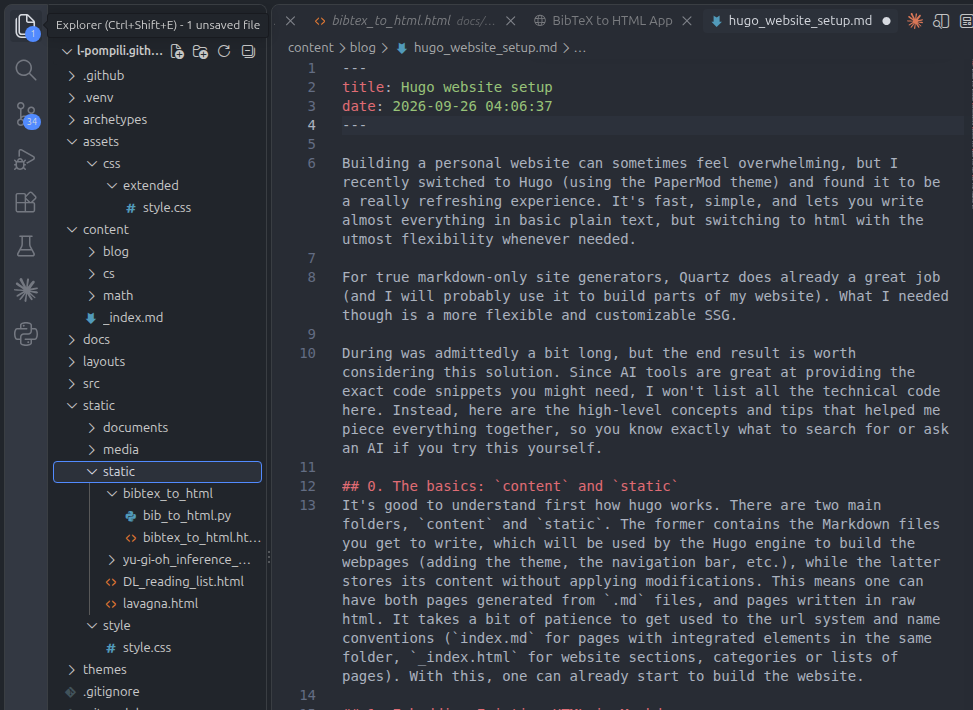

Building a personal website can sometimes feel overwhelming, but I recently switched to Hugo (using the PaperMod theme) and found it to be a really refreshing experience. It's fast, simple, and lets you write almost everything in basic plain text, but switching to html with the utmost flexibility whenever needed.

For true markdown-only site generators, Quartz does already a great job (and I will probably use it to build parts of my website). What I needed though is a more flexible and customizable SSG.

During was admittedly a bit long, but the end result is worth considering this solution. Since AI tools are great at providing the exact code snippets you might need, I won't list all the technical code here. Instead, here are the high-level concepts and tips that helped me piece everything together, so you know exactly what to search for or ask an AI if you try this yourself.

## 0. The basics: `content` and `static`
It's good to understand first how hugo works. There are two main folders, `content` and `static`. The former contains the Markdown files you get to write, which will be used by the Hugo engine to build the webpages (adding the theme, the navigation bar, etc.), while the latter stores its content without applying modifications. This means one can have both pages generated from `.md` files, and pages written in raw html. It takes a bit of patience to get used to the url system and name conventions (`index.md` for pages with integrated elements in the same folder, `_index.html` for website sections, categories or lists of pages). With this, one can already start to build the website.

## 1. Embedding Existing HTML in Markdown
Sometimes you have an old HTML snippet or a complex list that is just too tedious to convert into Markdown format. I learned that you don't actually have to rewrite it. You can create a simple custom "shortcode" in Hugo that reads an external HTML file and embeds it directly into your page.

The main tip: Look into Hugo's "Page Bundles." By organizing your folders so your HTML file sits right next to your Markdown file, your shortcode can easily find it and inject the content seamlessly.

## 2. Rendering Math with KaTeX
Because I studied math, being able to write equations easily was a mandatory feature for me. Hugo can handle LaTeX formulas beautifully if you add a Javascript renderer like KaTeX to your site.

The main tip: Don't load the KaTeX scripts globally. Loading heavy scripts on every single page slows down your website. Instead, you can add a simple conditional toggle to your site's header file, by modifying `/layouts/partials/extend_head.html`. This lets you load the math scripts only on the specific blog posts where you actually need them. In my case, it loads the math rendering machinery when the `.md` file contains the YAML property `math: true` at the top of the file.

## 3. Customizing Styles Without Breaking the Theme
I wanted to bring over a few visual touches from my old website, like my favorite blue hyperlinks and some Font Awesome icons for my GitHub links.

The main tip: Never edit the downloaded theme files directly, or your changes will disappear the next time the theme updates. Hugo has a built-in way to safely add your own custom CSS file: you can place it in `/assets/css/extended/`. More importantly, make sure to "scope" your custom CSS to just your article content (in PaperMod, this means adding .post-content before your link styles), and not the top level things generated by hugo like the navigation bar (unless you specifically want to do that). If, for instance, you apply hyperlink styles globally, you will accidentally change the colors of your site title, navigation menus, and even the dark-mode toggle button!

Setting this up took a little trial and error, but the result is a clean, easy-to-maintain site where you can just focus on writing.