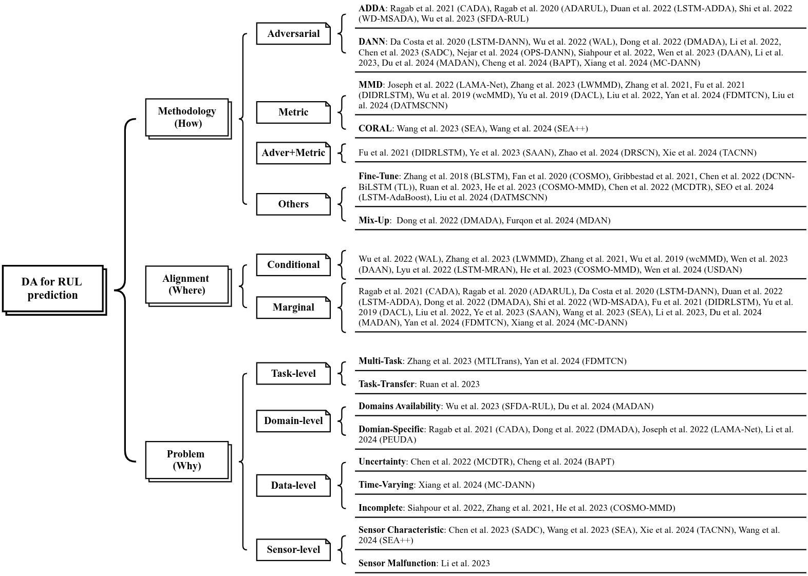

*RUL* ("remaining useful life") prediction for devices is gaining increasing attention in the recent literature. One problem is that of estimating RUL in cases where there training and test data from the sensors come from two different distributions A and B: this is called <i>Domain Adaptation</i> (DA). This is relevant when the device is used in certain conditions (settings, temperature, pressure,...) where there is little or no available labeled data, but there is enough labeled data in some other conditions.

*Domain Adversarial training* is one approach used to address such situations. The typical scenario involves a first "feature extraction" block that maps information from the data to representations in a latent space, followed by a classification block that tries to classify whether the data come from distribution A or B. A gradient-reversal layer for this classifier makes possible for the extractor to only select features that are invariant across the two distributions. Modifications of this approach have been considered, like multi-domain sourcing, CDAN (conditional DANN), integration with attention and TCN,... See [Wang et al. 2025](https://arxiv.org/abs/2510.03604) for a recent review.

<a href="https://arxiv.org/abs/2510.03604" class="external">Wang et al. 2025</a>

    

## Literature


